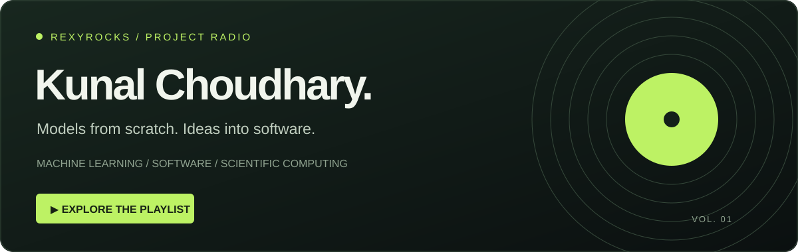
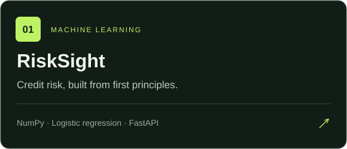
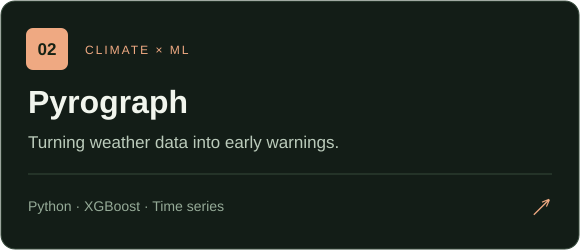
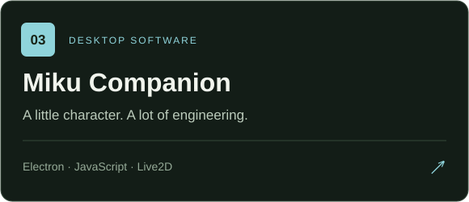
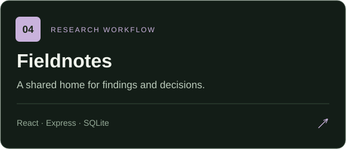

  <a href="https://project-radio-tau.vercel.app"><strong>▶ Open portfolio</strong></a> &nbsp; / &nbsp;
  <a href="#selected-work">Selected work</a> &nbsp; / &nbsp;
  <a href="#behind-the-builds">About me</a>

## Selected work

Four projects. Four different problems. One habit: learn by building.

  
  

  
  

<a href="https://project-radio-tau.vercel.app"><strong>Hear the story behind each project →</strong></a>

## Behind the builds

I'm **Kunal**, an IT student at **Manipal University Jaipur · Class of 2028**. I like understanding how models work, turning experiments into usable software, and designing interfaces that make complex ideas easier to explore.

| On my desk | On the horizon |
| :--- | :--- |
| Machine learning & scientific computing | Google Summer of Code 2027 |
| Data structures & algorithms in Java | An MS in Germany |
| Practical apps and thoughtful interfaces | More learning through open source |

### My toolkit

**Languages** &nbsp; Python · Java · JavaScript · C  
**Models & data** &nbsp; NumPy · scikit-learn · XGBoost · SQLite  
**Applications** &nbsp; FastAPI · React · Express · Electron  
**Everyday tools** &nbsp; Git · Linux · Bash

### Also in the collection

[**MU FindIt**](https://github.com/rexyrocks/lost-and-found) — Lost-and-found for the Manipal community.  
[**Striver DSA in Java**](https://github.com/rexyrocks/striver-dsa-java) — Building problem-solving fundamentals, one pattern at a time.

<strong>⌁ Contribution arcade</strong>

 

<picture>
  <source media="(prefers-color-scheme: dark)" srcset="https://raw.githubusercontent.com/rexyrocks/rexyrocks/output/pacman-contribution-graph-dark.svg">
  <source media="(prefers-color-scheme: light)" srcset="https://raw.githubusercontent.com/rexyrocks/rexyrocks/output/pacman-contribution-graph.svg">
  
</picture>

---

Made with curiosity. Best explored with the <a href="https://project-radio-tau.vercel.app">radio on ↗</a>

